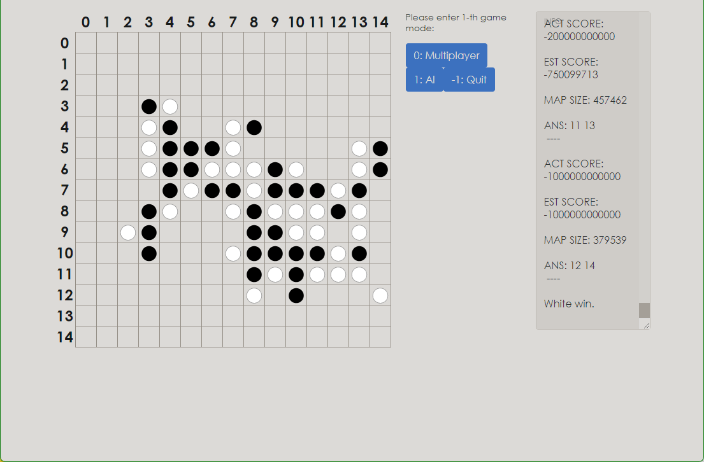

# LIMI GOMOKU AI

A traditional GomokuAI written in C++ & React

基于传统搜索算法（极大极小值算法 & AlphaBeta剪枝）的五子棋AI。后端使用C++、前端使用React编写。

此为后端项目库。前端项目库：https://github.com/tml104/limi_gomoku_front

(前端是学着写的所以那么丑，别骂了别骂了)

## 环境 & 依赖

- OS：Ubuntu 20.04 LTS（反正不是Windows，用WSL也行）

- 内存：8GB+ （我还没做性能优化，别骂了）

- GNU C++17

- Cmake

- Node.js v16.13.2

  > limi_gomoku_front@0.1.0 /home/tml104/nd/limi_gomoku_front
  > ├── @testing-library/jest-dom@5.16.2
  > ├── @testing-library/react@12.1.2
  > ├── @testing-library/user-event@13.5.0
  > ├── bootstrap@5.1.3
  > ├── react-bootstrap@2.1.2
  > ├── react-dom@17.0.2
  > ├── react-scripts@5.0.0
  > ├── react@17.0.2
  > └── web-vitals@2.1.4

## 部署 & 使用

1. 把后端项目拉到本地：`git clone https://github.com/tml104/limi_gomoku.git`
2. 把前端项目拉到本地：`git clone https://github.com/tml104/limi_gomoku_front.git`
3. 在后端目录`./limi_gomoku`，用cmake编译：`cmake .` （或者用VS将此目录打开后运行）
4. 运行`limi_gomoku`，此时服务端的Websocket服务器会监听`127.0.0.1:9999` 。
5. 在前端目录`./limi_gomoku_front`，运行`npm start`。前端会自动连接到`ws://localhost:9999`。当后端显示`Connected! :)`，表明后端已连接上前端，此时在浏览器访问`localahost:3000`，方可点击按钮进行操作。（以目前此项目的实现，不要刷新前端页面，否则前端会重新连接导致后端绑定错误的前端；如果不小心刷新请重新启动后端再来一次）
6. 一开始可选择玩家1、2的类型（AI或玩家真人）。在任何时候点击`Quit`按钮将回复到初始状态。如果选择了AI，则右侧会显示每一步的估分`ACT SCORE`和上一手棋的位置`ANS`。AI单步思考时间大约在10秒左右（别骂了，我写的常数太大了）
7. 开始下棋吧。

## 已知问题

- 内存开销略大
- 步数快接近平局时搜索节点数会爆炸（170多万个节点）
- -20000……等必胜局面的错误判定

## TODOs

- [ ] 算杀
- [ ] 注释
- [ ] 文档
